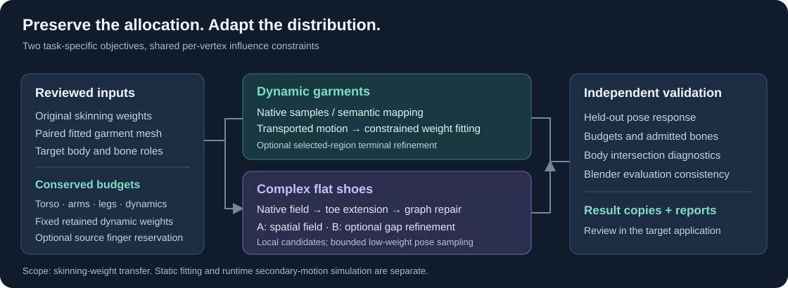
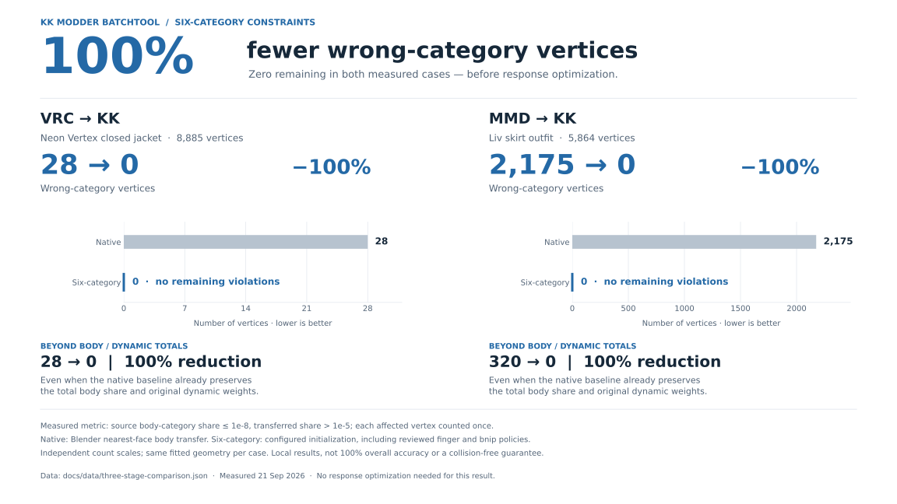
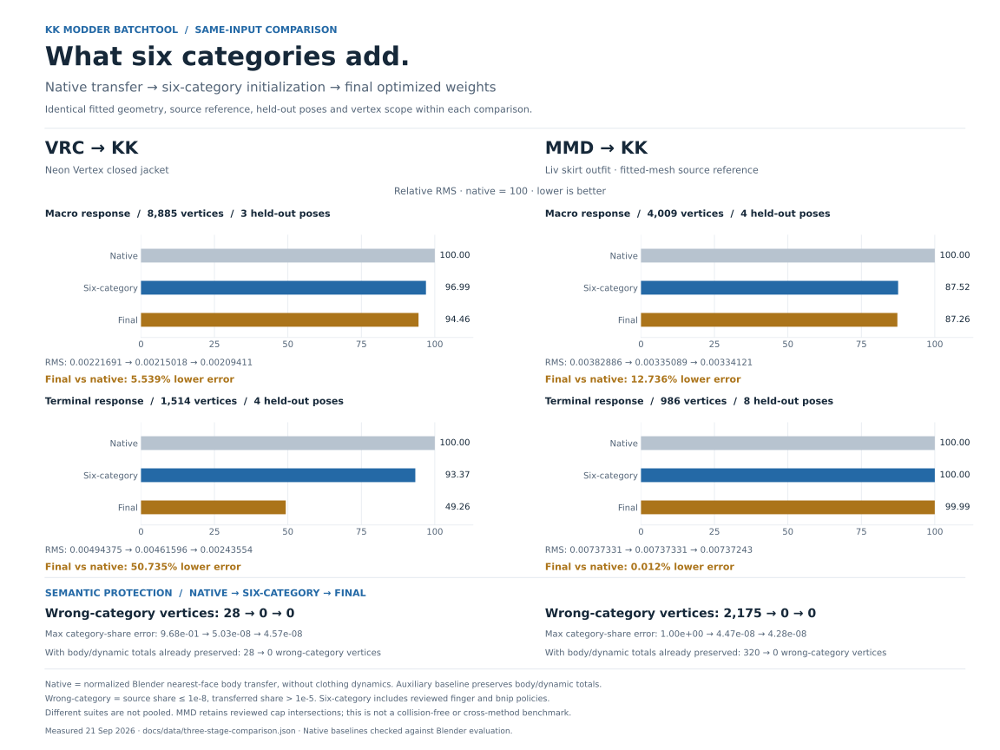
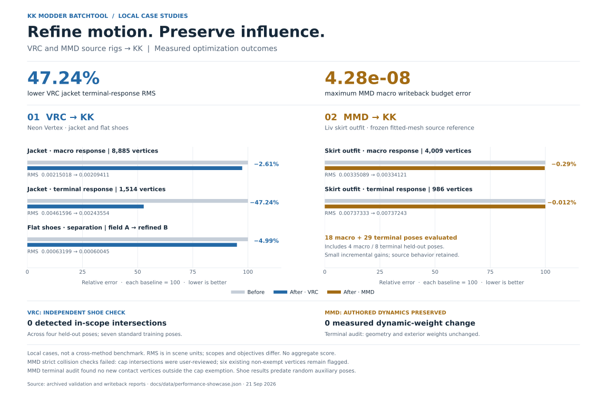

<div align="center">

# KK Modder BatchTool

### SBCST: Semantic Budget-Constrained Skinning Transfer

**Preserve authored body–dynamic influence. Adapt the body weights to a new character.**

[Paper](docs/paper/SBCST.pdf) · [Technical Report](docs/technical-report.md) · [User Guide](USER_GUIDE.md) · [Downloads](https://github.com/tomTom1010-IEE/KK_Modder-BatchTool/releases) · [License](LICENSE)

Blender add-on **0.2.24** · Blender **4.3+ declared minimum** · Local case studies on **Blender 5.2** · AGPL-3.0-only

</div>



*Method overview, not a rendered before/after result.*

**SBCST paper:** *Semantic Budget-Constrained Skinning Transfer for Garment Retargeting*, a 10-page technical manuscript presenting the general formulation, constrained optimization, scoped contact review, and quantitative case studies. [Read the PDF](docs/paper/SBCST.pdf) · [LaTeX source and build instructions](docs/paper/README.md). The paper is an independent technical manuscript, not a peer-reviewed publication.

## What it does

Retargeting clothing is more than copying nearby body weights. A collar can accidentally inherit arm influence; a ribbon can lose its intended body following; a long shoe tip can inherit an unsuitable distribution. This toolset preserves the original per-vertex influence allocation while fitting the remaining body weights to a new rig.

Two complementary workflows share the same principle:

| Dynamic garments | Complex flat shoes |
|---|---|
| Preserve six semantic budgets and retained dynamic-bone weights. | Preserve left/right body budgets and each retained lace-bone weight. |
| Initialize with Blender's native nearest-face interpolation or reviewed semantic mapping. | Sample the target foot with native interpolation and extend the field into long toe boxes. |
| Fit transported source motion with constrained optimization. | Repair spatial discontinuities, then optionally refine body–shoe separation over foot poses. |
| Optionally refine a selected wrist/hand region in a second stage. | Compare field-only A with gap-refined B on independent poses. |

The add-on also includes bone grafting, a conservative beginner workflow, whole-chain export cleanup, MMD garment preprocessing, and a companion Unity component-setup tool. **Static garment modeling and runtime cloth/secondary-motion simulation remain separate tasks.**

## Recorded results

### Six-category constraints: 100% fewer wrong-category vertices



This improvement is already present **before response optimization**. Against a stronger native baseline that preserves total body/dynamic influence, violations still fall **28 → 0 for VRC** and **320 → 0 for MMD**. The 100% reduction refers to this defined semantic-violation metric in these two cases, not overall accuracy or collision freedom.

[High-resolution PNG](docs/assets/six-category-showcase.png) · [Vector SVG](docs/assets/six-category-showcase.svg) · [Definitions and measurements](docs/three-stage-comparison.md#what-six-category-protection-contributes)

### Native transfer → six categories → final optimization



On identical held-out suites, final RMS is **50.735% lower for the VRC jacket terminal scope** and **12.736% lower for the MMD macro scope** than plain native transfer. Six-category initialization removes measured wrong-category influence: **28 → 0 VRC vertices** and **2,175 → 0 MMD vertices**. Even a native baseline that already preserves body/dynamic totals leaves **320** MMD vertices with wrong-category influence.

[Three-stage measurements, definitions, and stronger baseline](docs/three-stage-comparison.md) · [Full-size PNG](docs/assets/three-stage-comparison.png)

### Optimization-only stage improvements



[Full-size PNG](docs/assets/performance-showcase.png) · [Measurements and MMD collision-review scope](docs/performance-showcase.md) · [Figure data](docs/data/performance-showcase.json)

These are local development case studies, not a benchmark against other methods. Values are RMS errors in scene coordinate units; each row compares its own baseline and result. The garment and shoe objectives differ.

| Case and stage | Before | After | Reduction |
|---|---:|---:|---:|
| Closed jacket · macro response, 8,885 vertices | 0.00215018 | 0.00209411 | 2.61% |
| Closed jacket · terminal response, 1,514 selected vertices | 0.00461596 | 0.00243554 | 47.24% |
| Flat shoes · held-out separation RMS, A → B | 0.000631986 | 0.000600451 | 4.99% |
| MMD skirt outfit · macro response, 4,009 vertices | 0.003350889 | 0.003341212 | 0.29% |
| MMD skirt outfit · terminal response, 986 vertices | 0.007373327 | 0.007372434 | 0.012% |

The MMD extension preserves authored dynamic influence with small incremental motion-error improvements. Strict collision validation did not pass: cap intersections were accepted through user review, and six existing non-exempt vertices remained flagged in the terminal audit. These are not collision-free MMD results.

The shoe case passed four held-out poses without detected in-scope body intersections; actual body-budget and dynamic-weight errors were below `5e-8`. This case used seven standard training poses. The subsequently added low-weight random preset is **not** part of those measurements. Asset files are not redistributed; [measurement provenance and limitations](docs/technical-report.md#6-local-case-studies) are documented in the report.

## Start here

1. Install the Blender add-on folder/archive containing `kk_vrc_cloth_tools`, then enable **KK/VRC Cloth Tools**.
2. Open **3D View → N → KK/VRC Tools**. Choose **Dynamic Garment Weight Transfer** for garments or **Complex Flat-Shoe Weight Transfer** for shoes.
3. Supply the original weighted item, its already-fitted counterpart, and the target body. Scan and review bone roles and dynamic-root regions.
4. Generate a new result copy and inspect the validation report. Save the `.blend` explicitly.

The current interface is panel-driven: JSON is optional. Routine parameters are folded into advanced controls; unresolved semantic regions still require review. Garment optimization uses an external Python environment with [NumPy, SciPy, and OSQP](requirements-optimizer.txt); the shoe workflow uses Blender's bundled NumPy. See the [installation and guided workflows](USER_GUIDE.md).

## Documentation

| Read | Purpose |
|---|---|
| [Technical report](docs/technical-report.md) | Formulation, constraints, objectives, and measured scope |
| [User manual](USER_GUIDE.md) | Current panels, installation, review, execution, and troubleshooting |
| [Flat-shoe implementation notes](FLAT_SHOE_WORKFLOW_CN.md) | Spatial-field details; the user manual is authoritative for current UI navigation |
| [Weight core](WEIGHT_FEATURES_CN.md) / [Optimizer](WEIGHT_OPTIMIZER_CN.md) | Developer interfaces and invariants |
| [VRC profile](VRC_WEIGHT_SCHEMA_CN.md) / [MMD profile](MMD_WEIGHT_SCHEMA_CN.md) | Maintained source-rig semantics |
| [MMD preprocessing](MMD_PREPROCESS_CN.md) | Reviewed T-pose preparation and optimizer-entry limitations |

## Agent skills

The [`skills/`](skills/) directory contains the reusable agent workflows developed alongside this project. Each folder includes its `SKILL.md` and any supporting references or scripts. These are agent instructions, separate from the Blender add-on; copying them does not install Blender, an MCP connection, or Unity dependencies. The instructions are currently written in Chinese; the overview and installation instructions below are in English.

| Skill | Purpose |
|---|---|
| [blender-transfer-garments](skills/blender-transfer-garments/SKILL.md) | Shared scene inspection, backups, coordinate handling, preservation of garment design and normals, and mesh validation; includes the read-only midline diagnostic script |
| [blender-fit-close-garments](skills/blender-fit-close-garments/SKILL.md) | Fit close garments while preserving thickness, designed details, and relationships between dependent pieces; optional edge refinement when requested |
| [blender-fit-loose-garments](skills/blender-fit-loose-garments/SKILL.md) | Preserve authored looseness and layering while fitting garments and grafting clothing bone chains |
| [blender-transfer-dynamic-weights](skills/blender-transfer-dynamic-weights/SKILL.md) | Review body-following patterns, invoke the plugin's six-category transfer, preserve dynamics and selected fingers, and perform macro/terminal refinement |
| [unity-package-kk-accessories](skills/unity-package-kk-accessories/SKILL.md) | Prepare fitted accessories for the existing KK Unity project pipeline, including pivots, hierarchy, materials, physics components, prefabs, and accessory tables |

### Install and use

For Codex, copy the individual skill folders from this repository's `skills/` into `$CODEX_HOME/skills`, or `~/.codex/skills` when `CODEX_HOME` is unset. Keep the entire folder, including `references/` and `scripts/`; do not copy only `SKILL.md`. Compare or back up an existing same-named skill before replacing it. The two fitting skills rely on the shared `blender-transfer-garments` skill, so install them together. Start a new agent session after installation so the skill catalog can be refreshed.

Invoke a skill by name, for example:

```text
Use $blender-transfer-dynamic-weights to inspect this garment's original
body/dynamic weight patterns and prepare a six-category transfer plan.
```

Provide the actual source garment, fitted target, body, project paths, and intended scope. Blender workflows require a working Blender code-execution connection and, for weight processing, the installed add-on and relevant solver dependencies. The Unity skill assumes an existing KK project with its Editor Bridge, shaders, and runtime components; those dependencies are not bundled here. Do not apply its project-specific conventions to an unrelated Unity project.

The packaged skills retain their tested workflow guidance, including some historical API examples. Before executing an example, inspect the installed plugin version and function signatures. Unknown weight patterns still require Agent/manual analysis rather than automatic approval. Repository updates do not automatically update locally installed skills, and these workflows do not guarantee collision-free animation or replace user review.

## Scope and attribution

Original and fitted garment meshes must retain vertex correspondence; source and target bodies need not share topology. Existing skeletons and bone transforms are used, not learned. Automatic suggestions do not establish bone semantics, and passing discrete poses is not a guarantee against all collisions. The later MMD skirt-outfit case uses a frozen fitted-mesh source reference and is documented in the [performance showcase](docs/performance-showcase.md).

The [technical report](docs/technical-report.md) discusses SSDR and bounded biharmonic weights as related work. This project is not an implementation of SSDR, and makes no claim of outperforming it.

## License and responsibility

Copyright (c) 2026 tomTom. Unless otherwise stated, original project code and accompanying materials in this revision are licensed under the [GNU Affero General Public License, version 3 only](LICENSE) (`AGPL-3.0-only`). Third-party models, Blender, Unity packages, and solver dependencies retain their respective licenses. Previously released MIT versions remain available under their original terms; this change does not revoke those grants.

Commercial use is permitted under the AGPL. Users are responsible for ensuring that their use of the plugin, input assets, and resulting outputs complies with applicable laws and third-party rights, including any permissions required for commercial activities. To the fullest extent permitted by applicable law, the authors and contributors disclaim liability for claims, losses, damages, or other legal consequences arising from users' commercial activities involving the plugin or its outputs.

This responsibility statement clarifies the warranty and liability disclaimers in Sections 15–17 of the AGPL; it does not restrict commercial use, impose additional licensing conditions, or exclude liability that cannot legally be excluded. See [NOTICE.md](NOTICE.md).
