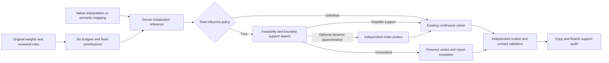

# Total influence constraints in SBCST 2.5.1

[User guide](../USER_GUIDE.md#choose-a-total-influence-policy) · [Method report](technical-report.md#7-deployment-extension-total-influence-constraints) · [Controlled dry run](influence-limit-benchmark.md) · [Paper](paper/SBCST.pdf)

The optional four-influence policy constrains the final unique bone support at each vertex. Body bones, enabled source fingers and retained dynamics share the same four slots. Parent bones do not consume slots merely by being ancestors. This is a selectable export target, not a claim that every Unity version/configuration has the same hard maximum.

## Configuration and compatibility

```json
{
  "influence_policy": {
    "max_influences": 4,
    "compress_dynamic": false,
    "dynamic_error_limit": 0.002
  }
}
```

New UI configurations default to four; saved legacy configurations and JSON/API contexts without `influence_policy` remain unlimited. Set `max_influences` to `0` to retain the dense workflow. Dynamic compression always defaults to false. The policy is included in plan/context/settings digests; modifying it requires re-preparation. Counts use all strictly positive final weights, including float32 writeback checks, with no hidden threshold-based removal.

## Shared architecture



For each vertex, the lower bound is the number of positive fixed bone weights plus the number of positive **residual** body categories. Enabled fingers already reserve part of their arm budget: an arm fully covered by a fixed finger does not require another slot. Positive categories, however small, cannot be dropped to satisfy cardinality.

The discrete search removes and exchanges candidate body bones, evaluates feasible regional fits, and admits only reviewed candidates. Training skinning responses rank combinations during macro/terminal solving; holdout poses never rank them. The first implementation uses bounded greedy deletion and at most 64 exchanges per vertex, rather than an exhaustive global combinatorial optimum. The inner OSQP problem jointly fits the selected weights with graph correction regularization and optional linearized contacts. If that support cannot satisfy the continuous/contact problem, the candidate is rejected; automatic contact-driven combinatorial retries are not implemented.

The dense anchor, feasible seed and support mask are distinct. Eliminated influences contribute constants to the graph correction objective; local correction bounds remain relative to the actual input, not a shifted sparse seed. Keeping four large weights only at the end would lose these guarantees.

Garment initialization writes a feasible body support where possible and preserves its dense reference in the plan. Dynamic approximation is deferred until probe evidence exists. Terminal optimization retains selected-core/transition limits and immutable exterior, and UI-exported runs recheck earlier macro holdouts. Advanced direct terminal API clients should export equivalent regression arrays if they need that additional gate.

Shoes retain their spatial field objective. The cap applies to `body_budget * conditional_distribution + dynamics`. A chooses support and reruns graph continuity within it; B preserves that mask during every simplex projection. The shoe B stage does not run a new discrete support search. Pure dynamic and exterior vertices still participate in full-mesh counting.

## Optional dynamic approximation

Compression is restricted to vertices whose fixed contributions plus required body-category slots exceed four. It cannot change enabled fingers or create a body category. The first implementation considers up to 64 subsets of existing dynamic influences, preserves their relative proportions within each retained subset and rescales to the original dynamic total. This is not equivalent to Unity's global top-four truncation.

Target-rig local X/Y/Z probes independently rotate each retained dynamic bone: 12 degrees for candidate ranking and -7 degrees for validation. Descendant transforms are sampled from Blender, and numerical LBS must agree with evaluated geometry. Probes restore the exact original pose channels. A dynamic subtree containing body-weighted descendants is rejected. The maximum displacement difference is normalized by garment span; default tolerance is 0.002. These are conservative implementation probes, not calibrated limits for every asset or a simulation of inertia/damping.

Accepted compressed results also require scoped face/surface collision checks in the independent dynamic poses. Finger contributions remain fixed, and original versus compressed weights are recoverable from the archived baseline. Garment validation blocks an unsuccessful compressed candidate; it does not learn from holdout failures. Shoes restore failed compressed vertices to unchanged, explicitly reported exceptions. Unchanged pure dynamic regions remain outside body-response fitting.

## Reports and acceptance

| Representation status | Meaning |
|---|---|
| `UNLIMITED` | No total-support limit was requested |
| `STRICT_FOUR` | Every vertex fits at most four positive bone weights |
| `RUNTIME_REVIEW_REQUIRED` | At least one unchanged exception exceeds four |

This axis is separate from motion/collision acceptance and from `runtime_validation: NOT_TESTED`. Collision-review authorization cannot convert a support exception into strict four compatibility. A successful solver status also cannot do so. Full-mesh checks include pure dynamics and immutable exterior; invalid budget, candidate, finger, or local-scope edits block writeback.

The UI exposes **Scan influence counts** and **Select over-limit vertices**. Reports contain exception indices/reasons, maximum counts, category error, fixed-contribution checks and optional dynamic probe results. Initial plans retain `dense_reference_writes`; shoe runs retain `dense-reference.npz` and `influence-support.json`. No Unity imported-data readback is automated. A user may review Unity's automatic reduction separately, but its result must not inherit the plugin's pre-import budget certificate.

## Validation scope

The September 28 two-jacket dry run now supplies a controlled comparison of legacy, unlimited, and four-influence modes. Unlimited final weights match the legacy solver exactly; median macro timings differ by +1.64% and +0.28%. Four-mode macro timings rise by 79.45% and 101.92%. The UI-like numerical pipeline has lower macro RMS in both cases but 8.68% higher terminal RMS on the open jacket. Closed-jacket support is fully four-compatible; the open jacket retains 140 unchanged exceptions, with a maximum of nine influences. Dynamic compression was disabled, so these measurements do not establish its approximation quality. [Full protocol and limitations](influence-limit-benchmark.md).

The compatibility controls are rendered in all three entry points. The September 28 patch removes ID-property writes from the draw callback; configuration migration remains a register/load operation. A blank Stage 3 title in an older installed copy is a drawing error, not a collapsed section. Current controls expose the policy and scan/selection actions, not automatic engine presets, a support-search progress dashboard, or automatic invalidation of displayed scan text.

Automated tests cover budget feasibility, fixed fingers, pure/mixed dynamics, optional approximation and missing probes, protected exterior, local bounds, removed-weight graph constants, shoe support projection, migration of saved settings, Blender pose restoration and float32 output. An opt-in archived-context smoke test exercises actual garment contexts without changing their files or the live scene. Numerical support checks alone do not certify arbitrary poses, cloth self-collision, other garments, body-shape editing, or runtime physics.
